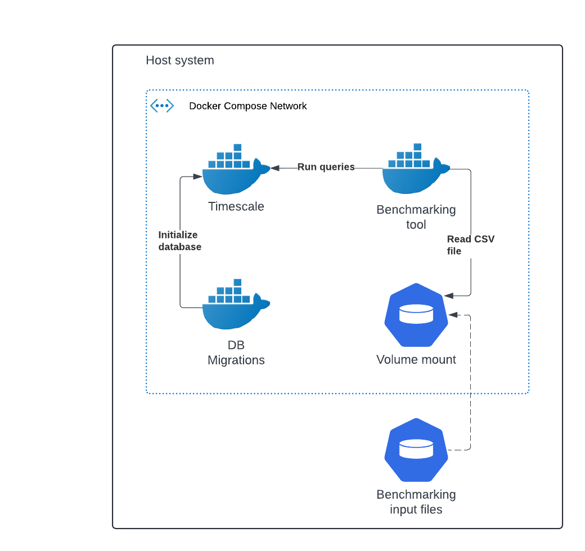
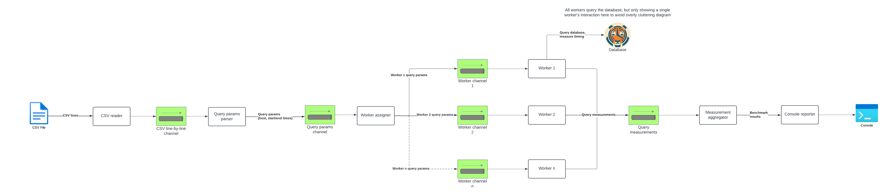

# Architecture

This page shows system and data pipeline architecture for the benchmarking tool

## Docker Compose architecture

When running entirely in Docker Compose, the architecture of system components looks like this:

The components are:

1. Timescale - the database holding CPU usage data
2. DB Migrations - Flyway scripts that initialize the database with a user and a populated CPU usage table
3. Benchmarking tool - The CLI used to benchmark CPU usage queries
4. Benchmarking input files mount - A volume mount to local files to allow testing different CSV files without
   rebuilding any images

## Benchmarking tool pipeline

The benchmarking tool is built as a streaming data pipeline in order to:

1. Process the CSV file line-by-line to avoid using too much memory with large CSV files
2. Run different steps of the pipeline concurrently and allow fanning out/in where necessary for performance/consolidation of results

The main components of the pipeline look like this:

